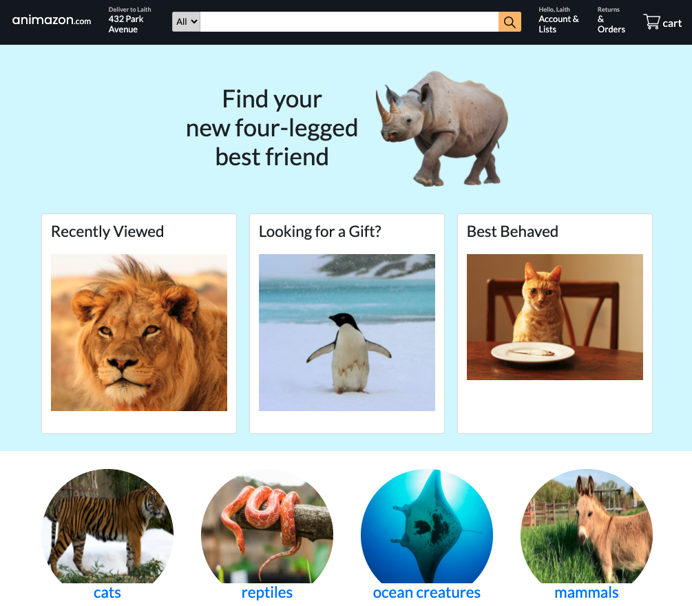

# animalzon

Fun shopping app for pets to practice graphql. The app queries for all of the animals, and single animal, and categories. There is a nested query because each animal belongs to a category.



|                                         |                                         |                                                   |
| :-------------------------------------: | :-------------------------------------: | :-----------------------------------------------: |
|       [Introduction](#animalzon)        | [Table of Contents](#table-of-contents) | [Development Highlights](#development-highlights) |
|      [Installation](#installation)      |    [Page Directory](#page-directory)    |       [Code Hightlights](#code-highlights)        |
| [Technologies Used](#Technologies-Used) |           [Credits](#Credits)           |                [License](#License)                |

## Development Highlights

- Create new Apollo Server that takes in the resolvers, typedefs, and context.
- Use Apollo Client to make the queries in the front end.

## Installation

Install packages at both the client and server folder.

```
npm i
```

## Page Directory

The resolvers are organized into it's own directory. The nested typedefs have their own resolvers and tehre are resolvers for the Mutation and Query. A schema.js is used to define the typedefs.

## Code Highlights

Queries used in GraphQL

```JavaScript
const Query = {
    mainCards: (parent, args, { mainCards }) => mainCards,
    animals: (parent, args, { animals }) => animals,
    animal: (parent, args, { animals }) => {
        let animalToBeFound = animals.find((animal) => {
            return animal.slug === args.slug
        })

        return animalToBeFound
    },
    categories: (parent, args, { categories }) => categories,
    category: (parent, args, { categories }) => {
        let category = categories.find((category) => {
            return category.slug === args.slug
        });
        return category

    }
}
```

## Technologies

### Back End GraphQL Server

- [Apollo_Server](https://github.com/apollographql/apollo-server)

### Front End GraphQL Libarary

- [Apollo_Client](https://www.apollographql.com/docs/react/)

## Code Highlights

## Credits

This project was apart of the [Laith Harb](https://www.youtube.com/watch?v=CFrKTrMJIBY&t=8895s) tutorial.

|                           |                                                                                                                                                                                                       |
| ------------------------- | ----------------------------------------------------------------------------------------------------------------------------------------------------------------------------------------------------- |
| **David Anusontarangkul** | [ LinkedIn](https://www.linkedin.com/in/anusontarangkul/) [ GitHub](https://github.com/anusontarangkul) |

## License

[](https://opensource.org/licenses/MIT)
